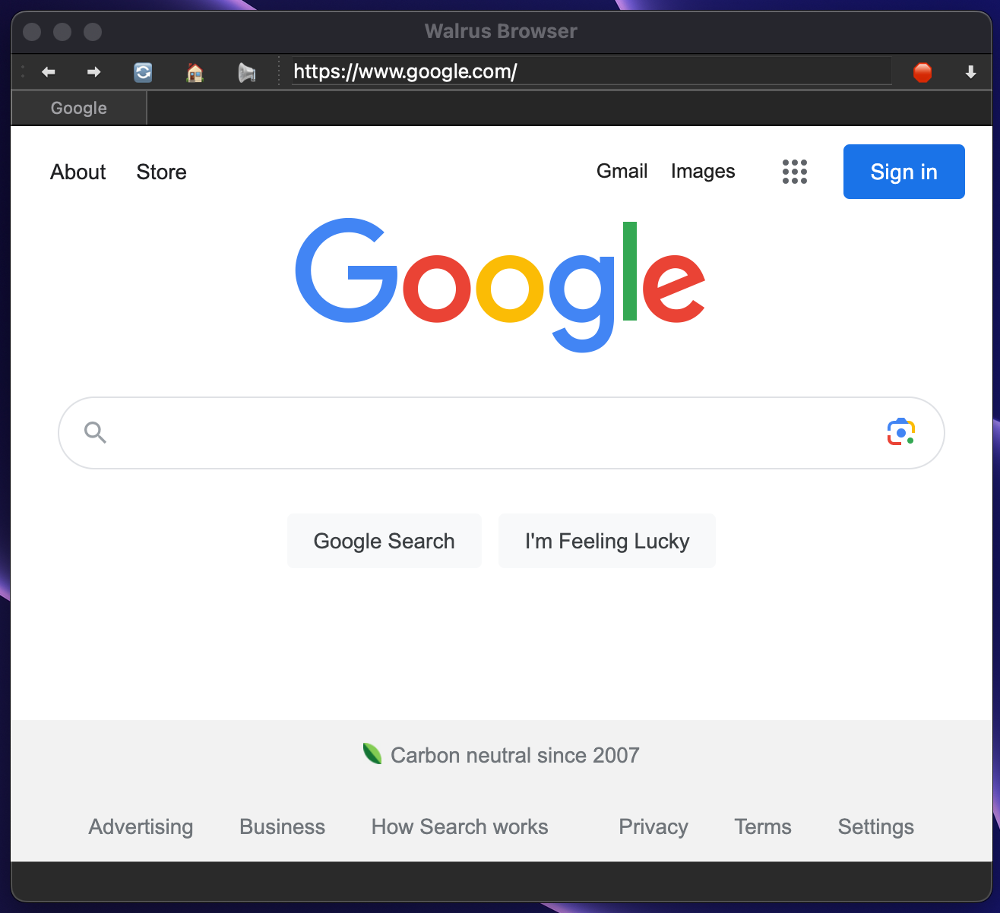

<h1 align="center">
  <br>
  
  <b>Walrus Browser</b>
  <br>
</h1>

<h4 align="center">A simple "browser" coded in Python with the help of PyQt5.</h4>

<p align="center">
  <a href="#download">Download</a> •
  <a href="#building">Building</a> •
  <a href="#usage">Usage</a> •
  <a href="#contributing">Contributing</a>
</p>


<h4 align="center"><i>Supports anything that can run Python and PyQt5.</i></h4>


## Download

The latest binaries are available on the [releases page](https://github.com/virgilholmes/walrus/releases/).

## Building
The only build i have for this is macOS. I only have a macbook and thats what its build for. If you have any other OS and would like to build, get in touch with me on <a href="https://twitter.com/virgilholmes404/">twitter</a>.
here are the steps for building.

```
pip install PyQt5
```
```
pip install PyQtWebEngine
```
```
cd walrus
```
```
py walrus.py
```
## Usage

Walrus opens a graphical interface. 


## Contributing

If you find any bugs or you would like to add a feature, make a [pull request](https://github.com/virgilholmes/walrus/pulls).
